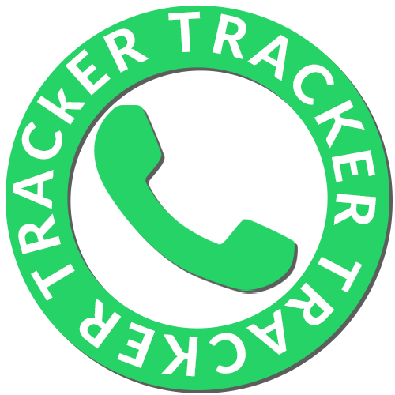

# WhatsApp Tracker build with selenium



# Demo


---

## Getting Started

### First

Clone the repo to your local machine:

```bash
git clone https://github.com/T-Damer/whatsAppTracker.git
```

Then cd into folder:

```bash
cd whatsAppTracker
```

### Second

Add the `.env` file to `whatsAppTracker` folder, consider looking at `.env.example`

List of variables:

|chromeUserPath                                              | tgToken                                                                                     |                                                 | SHEET_ID                                                                                    |
| ---------------------------------------------------------- | ------------------------------------------------------------------------------------------- |
| C:\Users\{YOURUSERNAME}\AppData\Local\Google\Chrome\User   | Your telegram bot token (you can get one from BotFather)                                    |

### Third

Install selenium driver (check Selenium folder, or download WEBDRIVER for Python [from here](https://www.selenium.dev/downloads/))

Then add location of `Selenium` folder [to your PATH variables](https://www.google.com/search?q=add+to+path&oq=add+to+path)

#### Fourth

Finally, run the `main.py`

---

<a href="https://www.buymeacoffee.com/tdamer"></a>
